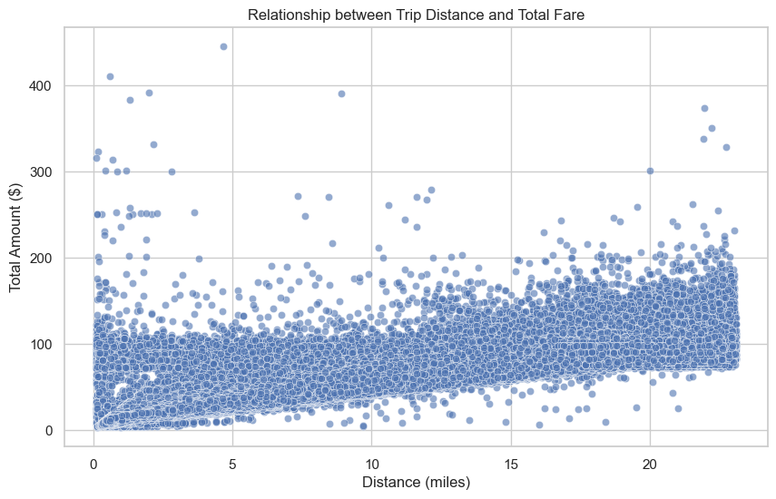
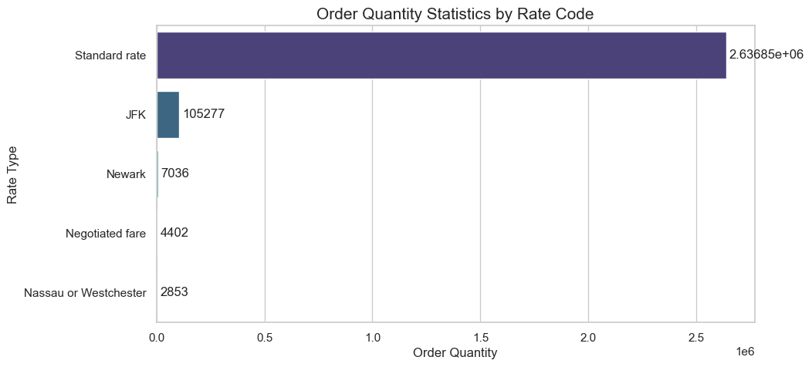
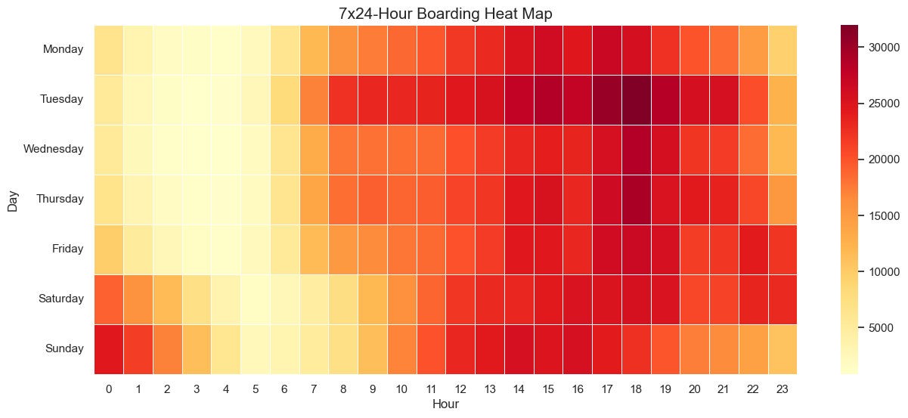
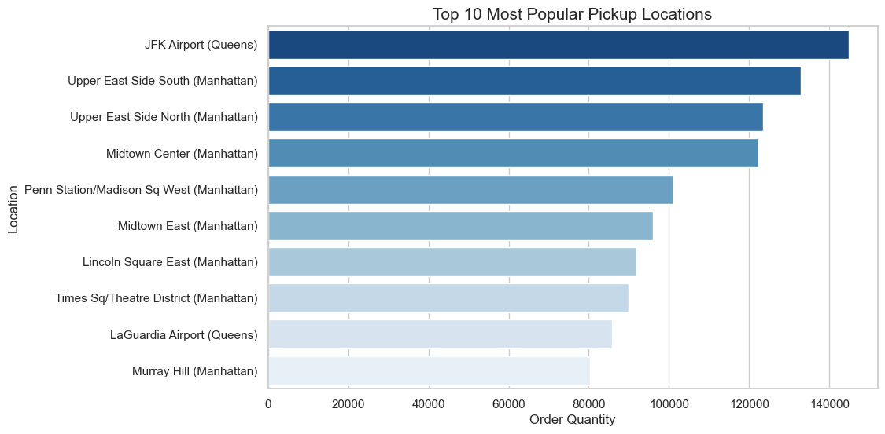
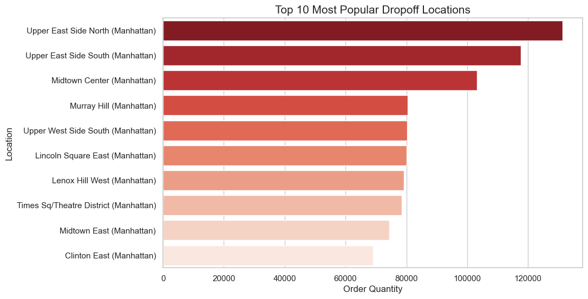
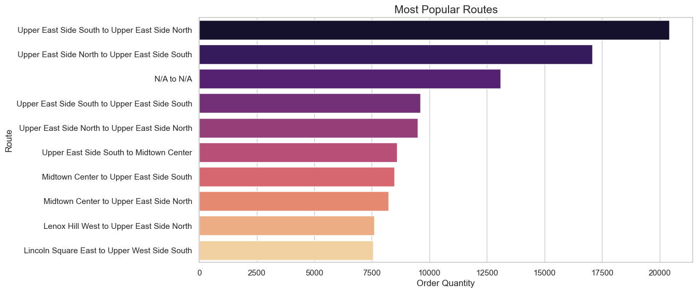
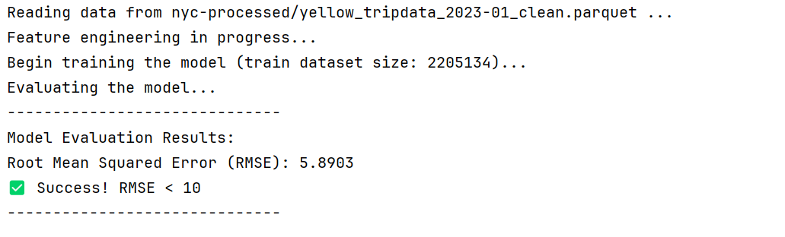

**Sujet :** NYC TLC Trip Record Data

**Professeur référent :** Rakib SHEIKH

**Membres de groupe :** REN Yanhao, ZHOU Kunyao

## EX1

### Prérequis

Pour exécuter ce programme, vous devez avoir **JDK 17** (Les autres versions peuvent fonctionner, mais sans test).

Construisez les dépendances selon `build.sbt`

Il faut ajouter code `--add-exports java.base/sun.nio.ch=ALL-UNNAMED` dans le VM Option

## EX2

### Prérequis

Pour exécuter ce programme, vous devez avoir **JDK 17** (Les autres versions peuvent fonctionner, mais sans test).`

Construisez les dépendances selon `build.sbt`

Il faut ajouter code `--add-exports java.base/sun.nio.ch=ALL-UNNAMED` dans le VM Option

## EX3

Nous avons opté pour le **modèle en étoile**, parce que :

1. **Performance des requêtes** : En tant que modèle dénormalisé, le schéma en étoile nécessite moins de jointures (JOINS) que le modèle en flocon. Dans un contexte Big Data (OLAP), réduire le nombre de jointures améliore considérablement la vitesse des agrégations et de la génération de rapports.
2. **Simplicité et lisibilité** : La structure, composée d'une table de faits centrale connectée directement aux tables de dimensions, est intuitive. Cette simplicité réduit la complexité d'écriture des requêtes SQL et facilite la compréhension des relations de données par les équipes métier.
3. **Adaptabilité aux données** : Les dimensions du projet (modes de paiement, vendeurs, codes tarifs) possèdent des hiérarchies simples et un faible volume de données. Il n'est donc pas nécessaire d'appliquer la normalisation stricte d'un modèle en flocon pour économiser de l'espace disque. Le modèle en étoile offre ainsi le meilleur équilibre entre performance et facilité d'utilisation.

## EX4

### Prérequis

Pour exécuter ce programme, vous devez avoir **Python 3.12** (Les autres versions peuvent fonctionner, mais sans test).

Ouvrez votre terminal (PowerShell ou CMD) et installez les bibliothèques Python nécessaires :

```cmd
uv sync
```

### Usage

Lancez `dashboard.ipynb` avec votre IDE préféré.

### Screenshot













## EX5

### Prérequis

Pour exécuter ce programme, vous devez avoir **Python 3.12** (Les autres versions peuvent fonctionner, mais sans test).

Ouvrez votre terminal (PowerShell ou CMD) et installez les bibliothèques Python nécessaires :

```cmd
uv sync
```

### Usage

Lancez `main.py` avec votre IDE préféré.

### PEP 8

4 lignes de code dépassent la limite de 79 caractères imposée par la norme PEP 8, mais elles n'ont pas été scindées afin de préserver la lisibilité.

### Résultat

